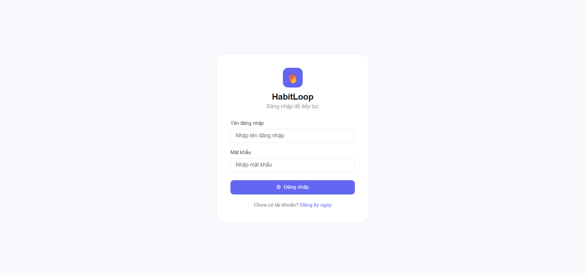
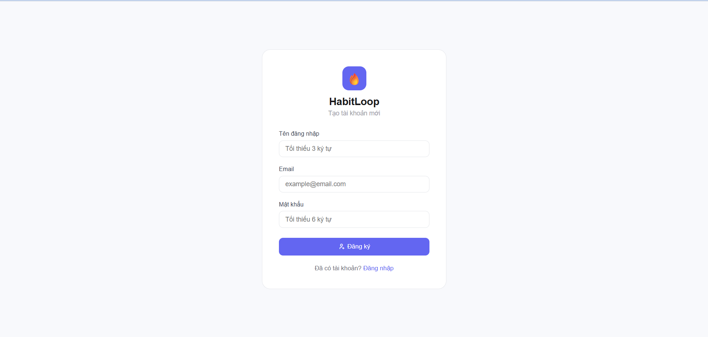
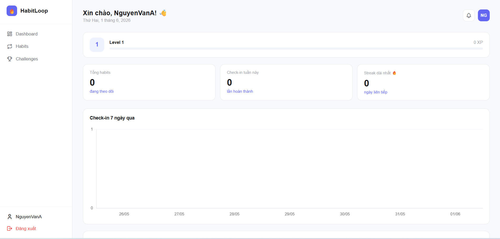
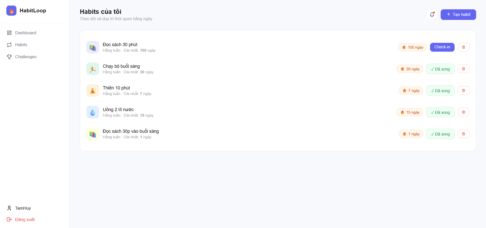
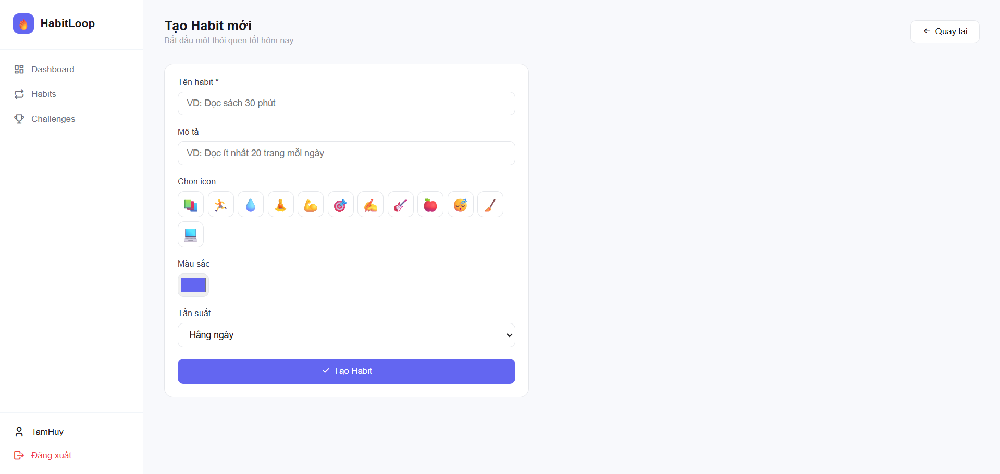
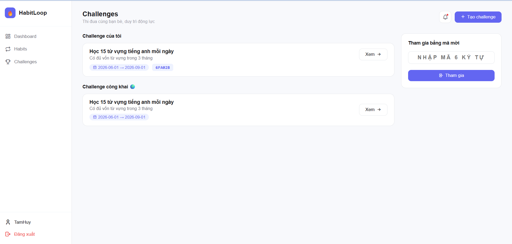
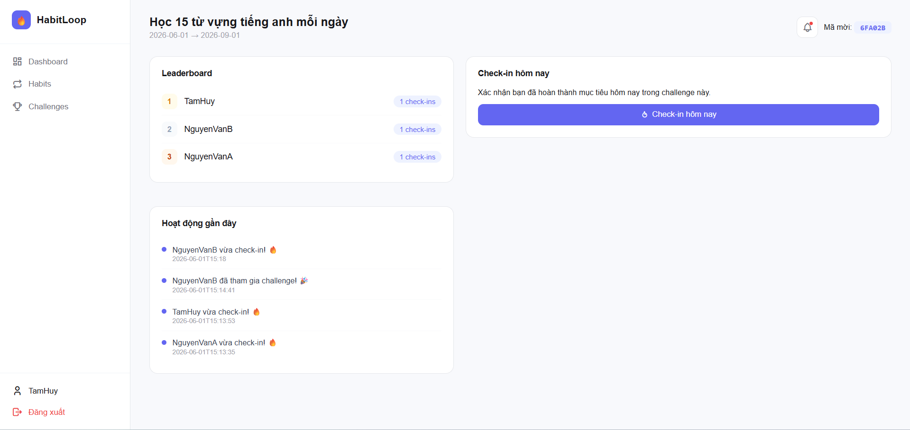
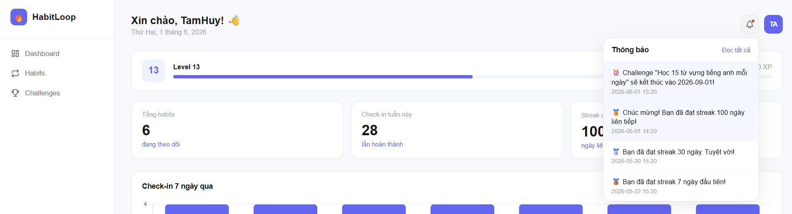

# 🔥 HabitLoop — Ứng dụng theo dõi thói quen & Challenge nhóm

HabitLoop là nền tảng web giúp người dùng tạo và duy trì thói quen cá nhân, đồng thời tham gia các challenge nhóm với leaderboard cập nhật **realtime** qua WebSocket. Hệ thống tích hợp gamification với điểm XP, cấp độ và huy hiệu thành tích để tăng động lực người dùng.

---

## 📋 Mô tả ứng dụng

Ứng dụng **HabitLoop** là nền tảng theo dõi thói quen cá nhân kết hợp tính năng thi đua nhóm, được thiết kế nhằm giúp người dùng xây dựng và duy trì các thói quen tốt một cách bền vững. Hệ thống cho phép tạo thói quen cá nhân, check-in hằng ngày để duy trì streak, tham gia challenge cùng bạn bè và theo dõi tiến độ qua dashboard trực quan. Nhờ hệ thống gamification với điểm XP, cấp độ và badge thành tích, người dùng luôn có thêm động lực để không bỏ lỡ ngày check-in nào.

---

## 🛠️ Công nghệ sử dụng

Dự án được xây dựng trên mô hình **Full-Stack** với các công nghệ hiện đại:

- **Backend:** Java 17, Spring Boot 4.0.6, Spring Security + JWT (Xác thực & Bảo mật)
- **Database:** MySQL / Spring Data JPA & Hibernate (Quản lý và tương tác cơ sở dữ liệu)
- **Frontend:** HTML5, CSS3, Thymeleaf (Engine kết xuất giao diện), Bootstrap 5, Tabler Icons
- **Realtime:** WebSocket (STOMP + SockJS) — Leaderboard cập nhật tức thì
- **Biểu đồ:** Chart.js — Dashboard thống kê tiến độ
- **Công cụ quản lý thư viện:** Maven
- **Môi trường phát triển:** Eclipse IDE, XAMPP (MySQL)

---

## ✨ Các chức năng chính

### 🔐 Xác thực (Authentication)
- Đăng ký tài khoản với validation đầy đủ
- Đăng nhập bảo mật bằng JWT Token lưu trong HttpOnly Cookie
- Mật khẩu mã hóa bằng BCrypt

### 📋 Quản lý Habit
- Tạo thói quen cá nhân với tên, mô tả, icon, màu sắc và tần suất (hằng ngày / hằng tuần)
- Check-in một lần mỗi ngày bằng một cú click
- Hệ thống **Streak** 🔥 tự động tính toán: đếm ngày liên tiếp, reset về 0 nếu bỏ lỡ
- Xem lịch sử và streak dài nhất của từng habit

### 🏆 Challenge nhóm
- Tạo challenge công khai hoặc riêng tư với thời hạn tùy chỉnh
- Mời bạn bè tham gia bằng **Invite Code** 6 ký tự
- Check-in trong challenge mỗi ngày một lần
- **Leaderboard Realtime** — cập nhật tức thì khi thành viên check-in qua WebSocket STOMP

### 🎮 Gamification
- **Điểm XP**: +10 XP mỗi lần check-in habit
- **Cấp độ**: Tự động tăng cấp theo tổng XP tích lũy
- **Badge thành tích**: 🥉 Streak 7 ngày, 🥈 Streak 30 ngày, 🥇 Streak 100 ngày
- **Activity Feed**: Hiển thị hoạt động gần đây trong challenge

### 🔔 Thông báo
- Chuông thông báo với badge số lượng chưa đọc
- Dropdown thông báo khi challenge sắp kết thúc
- Scheduled job tự động tạo thông báo mỗi sáng 8h

### 📊 Dashboard & Thống kê
- Biểu đồ cột check-in 7 ngày qua (Chart.js)
- Thống kê: tổng habit, check-in tuần, streak dài nhất
- XP Bar hiển thị tiến độ lên cấp
- Danh sách huy hiệu đã nhận

---

## 🎬 Video Demo

> Xem video demo đầy đủ các tính năng của HabitLoop tại link bên dưới:

[](LINK_VIDEO_CUA_BAN)

> 📌 **Thay `LINK_VIDEO_CUA_BAN` bằng link YouTube / Google Drive của bạn.**

---

## 🖼️ Giao diện hệ thống

### 1. Trang đăng ký & Đăng nhập
> Giao diện xác thực tối giản, card căn giữa trang với validation inline hiển thị lỗi ngay dưới từng trường nhập liệu.

| Đăng ký | Đăng nhập |
|---|---|
|  |  |

---

### 2. Dashboard
> Trang tổng quan sau khi đăng nhập. Hiển thị lời chào, XP bar tiến độ lên cấp, 3 stat card (tổng habit, check-in tuần, streak dài nhất), biểu đồ cột check-in 7 ngày và danh sách badge đã nhận.



---

### 3. Danh sách Habit
> Hiển thị toàn bộ habit của người dùng dạng card list. Mỗi card có icon màu sắc riêng, tên, tần suất, streak dài nhất, badge streak hiện tại và nút Check-in. Sau khi check-in, nút chuyển sang trạng thái "Đã xong" và bị vô hiệu hóa trong ngày.



---

### 4. Tạo Habit mới
> Form tạo habit với bộ chọn icon trực quan (12 emoji), color picker màu sắc cá nhân hóa và dropdown tần suất.



---

### 5. Danh sách Challenge
> Trang Challenge chia 2 cột: danh sách challenge đang tham gia (kèm invite code) và challenge công khai, cùng form tham gia nhanh bằng mã mời 6 ký tự.



---

### 6. Chi tiết Challenge & Leaderboard Realtime
> Trang chi tiết challenge hiển thị leaderboard xếp hạng thành viên (top 3 có màu vàng/bạc/đồng), form check-in 1 click và activity feed các hoạt động gần đây. Leaderboard **tự động cập nhật realtime** qua WebSocket khi thành viên check-in mà không cần reload trang.



---

### 7. Thông báo
> Chuông thông báo trên navbar với badge đỏ hiển thị số lượng chưa đọc. Nhấn chuông mở dropdown danh sách thông báo, thông báo chưa đọc có nền xanh nhạt.



---

## 🖼️ Giao diện hệ thống

| Trang | Mô tả |
|---|---|
| `Đăng nhập / Đăng ký` | Form xác thực với validation inline |
| `Dashboard` | Thống kê tổng quan, biểu đồ, badge |
| `Habits` | Danh sách habit, nút check-in, streak badge |
| `Tạo Habit` | Form tạo habit với icon picker, color picker |
| `Challenges` | Danh sách challenge, form tham gia bằng mã |
| `Challenge Detail` | Leaderboard realtime, check-in, activity feed |

---

## 🏗️ Kiến trúc hệ thống

Dự án được thiết kế theo mô hình kiến trúc phân tầng tiêu chuẩn, kết hợp **MVC** ở tầng giao diện và **Service-Repository** ở tầng xử lý nghiệp vụ.

```
+-------------------------------------------------------+
|               Trình duyệt / Người dùng                |
+---------------------------+---------------------------+
                            |
              HTTP Request  |  HTTP Response
              (Form, JSON)  |  (HTML, Thymeleaf)
                            v
+-------------------------------------------------------+
|          TẦNG GIAO DIỆN (PRESENTATION LAYER)          |
|  - Thymeleaf Templates (HTML5, Bootstrap 5)           |
|  - Chart.js (Dashboard), SockJS + STOMP (WebSocket)   |
+---------------------------+---------------------------+
                            |
                            v
+-------------------------------------------------------+
|           BỘ LỌC BẢO MẬT (SPRING SECURITY)           |
|  - JWT Authentication (HttpOnly Cookie)               |
|  - JwtAuthFilter — Xác thực mỗi request              |
+---------------------------+---------------------------+
                            |
                            v
+-------------------------------------------------------+
|          TẦNG ĐIỀU HƯỚNG (CONTROLLER LAYER)           |
|  - AuthController         - HabitController           |
|  - DashboardController    - ChallengeController       |
|  - NotificationController                             |
+---------------------------+---------------------------+
                            |
                            v
+-------------------------------------------------------+
|           TẦNG NGHIỆP VỤ (SERVICE LAYER)              |
|  - AuthService            - HabitService              |
|  - DashboardService       - ChallengeService          |
|  - NotificationService                                |
+---------------------------+---------------------------+
                            |
                            v
+-------------------------------------------------------+
|        TẦNG TRUY CẬP DỮ LIỆU (REPOSITORY LAYER)      |
|  - UserRepository         - HabitRepository           |
|  - CheckinRepository      - ChallengeRepository       |
|  - ChallengeMemberRepository - BadgeRepository        |
|  - ActivityFeedRepository - NotificationRepository    |
+---------------------------+---------------------------+
                            |
                            v
+-------------------------------------------------------+
|              CƠ SỞ DỮ LIỆU (DATABASE)                |
|  - MySQL — users, habits, checkins, challenges,       |
|    challenge_members, badges, user_badges,            |
|    activity_feed, notifications                       |
+-------------------------------------------------------+
```

---

## 📁 Cấu trúc thư mục dự án

```
src/
├── main/
│   ├── java/
│   │   └── com/habitloop/
│   │       ├── HabitloopApplication.java        # File khởi chạy chính
│   │       │
│   │       ├── config/                          # Cấu hình hệ thống
│   │       │   ├── SecurityConfig.java          # Spring Security + JWT
│   │       │   ├── WebSocketConfig.java         # STOMP WebSocket
│   │       │   └── ScheduledTasks.java          # Scheduled jobs (8h sáng)
│   │       │
│   │       ├── controller/                      # Tầng tiếp nhận Request
│   │       │   ├── AuthController.java          # Đăng ký, Đăng nhập, Đăng xuất
│   │       │   ├── HabitController.java         # CRUD Habit, Check-in
│   │       │   ├── ChallengeController.java     # Challenge, Join, Check-in + WebSocket
│   │       │   ├── DashboardController.java     # Dashboard & Thống kê
│   │       │   └── NotificationController.java  # API thông báo
│   │       │
│   │       ├── entity/                          # Tầng Entity (Database)
│   │       │   ├── User.java                   # Tài khoản người dùng
│   │       │   ├── Habit.java                  # Thói quen (streak, frequency)
│   │       │   ├── Checkin.java                # Lịch sử check-in
│   │       │   ├── Challenge.java              # Challenge nhóm
│   │       │   ├── ChallengeMember.java        # Thành viên challenge
│   │       │   ├── Badge.java                  # Huy hiệu thành tích
│   │       │   ├── UserBadge.java              # Badge của user
│   │       │   ├── ActivityFeed.java           # Feed hoạt động
│   │       │   └── Notification.java           # Thông báo
│   │       │
│   │       ├── repository/                     # Tầng truy vấn dữ liệu (JPA)
│   │       │   ├── UserRepository.java
│   │       │   ├── HabitRepository.java
│   │       │   ├── CheckinRepository.java
│   │       │   ├── ChallengeRepository.java
│   │       │   ├── ChallengeMemberRepository.java
│   │       │   ├── BadgeRepository.java
│   │       │   ├── UserBadgeRepository.java
│   │       │   ├── ActivityFeedRepository.java
│   │       │   └── NotificationRepository.java
│   │       │
│   │       ├── service/                        # Tầng xử lý nghiệp vụ
│   │       │   ├── AuthService.java            # Đăng ký, Đăng nhập, JWT
│   │       │   ├── HabitService.java           # Streak logic, Badge, XP
│   │       │   ├── ChallengeService.java       # Invite code, Leaderboard
│   │       │   ├── DashboardService.java       # Thống kê, Chart data
│   │       │   ├── NotificationService.java    # Quản lý thông báo
│   │       │   └── CustomUserDetailsService.java # Spring Security
│   │       │
│   │       ├── security/                       # Bảo mật
│   │       │   ├── JwtUtil.java               # Generate & Validate JWT
│   │       │   └── JwtAuthFilter.java         # Filter xác thực mỗi request
│   │       │
│   │       └── dto/                           # Data Transfer Objects
│   │           ├── LoginRequest.java
│   │           ├── RegisterRequest.java
│   │           └── AuthResponse.java
│   │
│   └── resources/
│       ├── application.properties             # Cấu hình DB, JWT, Server
│       │
│       ├── static/
│       │   └── css/
│       │       └── style.css                 # CSS tùy chỉnh toàn bộ UI
│       │
│       └── templates/                        # Giao diện Thymeleaf
│           ├── auth/
│           │   ├── login.html               # Trang đăng nhập
│           │   └── register.html            # Trang đăng ký
│           ├── dashboard/
│           │   └── index.html               # Dashboard chính
│           ├── habit/
│           │   ├── list.html                # Danh sách habit
│           │   └── create.html              # Form tạo habit
│           ├── challenge/
│           │   ├── list.html                # Danh sách challenge
│           │   ├── create.html              # Form tạo challenge
│           │   └── detail.html              # Chi tiết + Leaderboard realtime
│           └── fragments/
│               └── navbar.html              # Sidebar navigation dùng chung
```

---

## 🚀 Hướng dẫn chạy dự án

### 🛠️ Yêu cầu chuẩn bị

Trước khi chạy dự án, hãy đảm bảo máy tính đã cài đặt:

- **Java Development Kit (JDK) 17** trở lên
- **XAMPP** (Apache + MySQL đang chạy)
- **Eclipse IDE for Enterprise Java Developers**
- **Lombok Plugin** đã cài vào Eclipse (tải tại [projectlombok.org](https://projectlombok.org/download))

---

### 🗄️ Bước 1: Cấu hình cơ sở dữ liệu

**1. Tạo Database**

Mở phpMyAdmin (`http://localhost/phpmyadmin`) và tạo database mới:

```sql
CREATE DATABASE habitloop
CHARACTER SET utf8mb4
COLLATE utf8mb4_unicode_ci;
```

**2. Thêm dữ liệu Badge**

```sql
INSERT INTO badges (name, icon, condition_type, condition_value) VALUES
('Streak 7 ngày', '🥉', 'STREAK_7', 7),
('Streak 30 ngày', '🥈', 'STREAK_30', 30),
('Streak 100 ngày', '🥇', 'STREAK_100', 100);
```

**3. Cấu hình kết nối MySQL**

Mở file `src/main/resources/application.properties`:

```properties
spring.datasource.url=jdbc:mysql://localhost:3306/habitloop?useSSL=false&serverTimezone=Asia/Ho_Chi_Minh&allowPublicKeyRetrieval=true
spring.datasource.username=root
spring.datasource.password=

spring.jpa.hibernate.ddl-auto=update
spring.jpa.show-sql=true
spring.jpa.properties.hibernate.dialect=org.hibernate.dialect.MySQLDialect

spring.thymeleaf.cache=false
spring.thymeleaf.encoding=UTF-8

jwt.secret=habitloop-super-secret-key-2024-abcxyz
jwt.expiration=86400000

server.port=8080
```

> Thay `password=` bằng mật khẩu MySQL của bạn nếu có.

---

### 💻 Bước 2: Import và chạy dự án trong Eclipse

**1. Import dự án**

- Mở Eclipse → **File → Import...**
- Chọn **Maven → Existing Maven Projects** → **Next**
- Nhấn **Browse...** → chọn thư mục dự án (có file `pom.xml`)
- Nhấn **Finish** và chờ Eclipse tải thư viện

**2. Update Maven**

Chuột phải vào project → **Maven → Update Project** (Alt+F5) → **OK**

**3. Chạy ứng dụng**

Chuột phải vào project → **Run As → Spring Boot App**

Console hiện thông báo thành công:

```
Started HabitloopApplication in X seconds
```

---

### 🌐 Bước 3: Truy cập ứng dụng

Mở trình duyệt và truy cập:

```
http://localhost:8080
```

Hệ thống tự động chuyển hướng đến trang đăng nhập. Bạn có thể:

- **Đăng ký** tài khoản mới tại `/auth/register`
- **Đăng nhập** tại `/auth/login`
- Trải nghiệm đầy đủ các tính năng: Habit, Challenge, Dashboard, Leaderboard realtime

---

### ✅ Hoàn tất

Nếu mọi bước đều thực hiện thành công, ứng dụng HabitLoop sẽ hoạt động tại:

```
http://localhost:8080
```

---

## 👨‍💻 Thông tin đồ án

| Thông tin | Chi tiết |
|---|---|
| **Môn học** | Phát triển ứng dụng Web 2 |
| **Trường** | Đại học Nha Trang |
| **Khoa** | Công nghệ Thông tin |
| **GVHD** | ThS. Mai Cường Thọ |
| **Sinh viên** | Nguyễn Phúc Tâm Huy |
| **MSSV** | 65131313 |
| **Năm** | 2026 |

---

